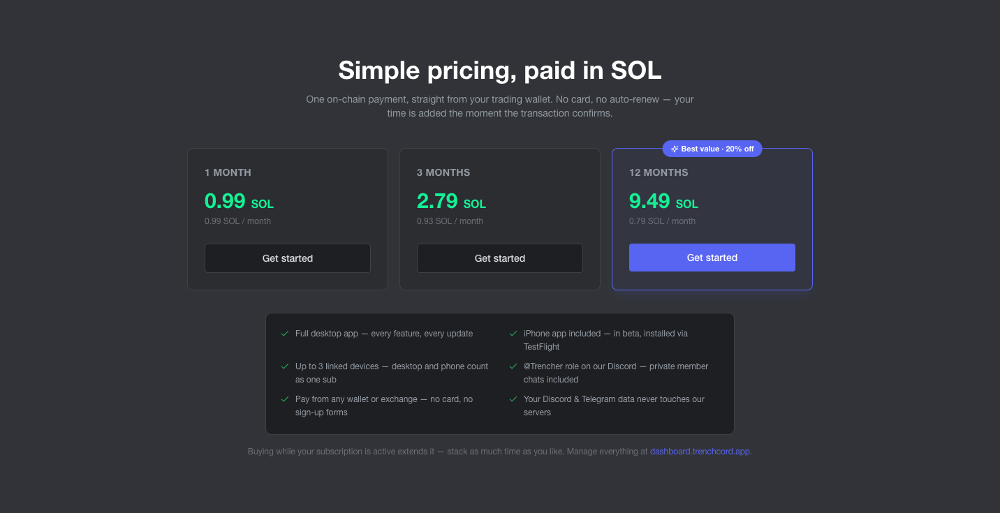

# Trenchcord

[](https://github.com/DanielHighETH/trenchcord/releases)
[](https://github.com/DanielHighETH/trenchcord/releases/latest)
[](LICENSE)
[](https://discord.gg/cDhrRVZ9xg)

**Your Discord and Telegram, Supercharged for Trenching**

Aggregate channels, track key users, auto-detect contracts, and trade in one click — all from a single dashboard. Trenchcord is a custom Discord frontend that combines multiple guild channels and DMs into custom "rooms" with user highlighting, keyword alerts, contract address detection, and optional chat capabilities.

**Download the desktop app for [macOS](https://github.com/DanielHighETH/trenchcord/releases/latest/download/Trenchcord-mac.dmg) or [Windows](https://github.com/DanielHighETH/trenchcord/releases/latest/download/Trenchcord-Setup.exe)** — or [self-host](#self-host) it from source. Your token and data stay entirely on your own machine.

> **Note:** The hosted web app has been discontinued. Trenchcord now runs as a desktop app (or self-hosted). Join our [Discord](https://discord.gg/cDhrRVZ9xg) for help and updates.

## Features

- **Custom Rooms** — Aggregate channels from multiple servers into unified rooms
- **Category Following** — Add a whole Discord category to a room; channels added to or removed from it in Discord follow automatically
- **User Highlighting** — Track key users across all channels with visual alerts
- **Contract Detection** — Auto-detect Solana and EVM contract addresses in messages
- **One-Click Buys** — Buy a Solana token straight from the message that called it, via Slotshark
- **Trade Links** — Click contracts to open Axiom, GMGN, Bloom, Padre, fomo.family and more
- **Push Notifications** — Pushover alerts when highlighted users post contracts
- **Focus Mode** — Filter messages to a specific channel within a room
- **Real-time Streaming** — Live message updates via Discord Gateway
- **DM Support** — Monitor DMs alongside guild channels
- **Sound Alerts** — Audio notifications for highlighted messages
- **Guild Colors** — Color-code messages by guild for quick visual scanning
- **Auto-Open Contracts** — Automatically open links when highlighted users post contracts
- **Custom Link Templates** — Configure which trading platform links generate for contracts
- **Quick Reply & Chat** — Send messages and files directly from the dashboard with a built-in channel selector

## Download

The easiest way to get started — no Node, no terminal. Download and install, then on first launch: link your Trenchcord account — the app shows a pairing code you approve at [dashboard.trenchcord.app](https://dashboard.trenchcord.app) (accounts are created right there), and an active [subscription](#pricing) unlocks the app. Then paste your Discord token and you're in.

| Platform | Download |
| --- | --- |
| **macOS** (Intel & Apple Silicon) | [Trenchcord-mac.dmg](https://github.com/DanielHighETH/trenchcord/releases/latest/download/Trenchcord-mac.dmg) |
| **Windows** (10 & 11) | [Trenchcord-Setup.exe](https://github.com/DanielHighETH/trenchcord/releases/latest/download/Trenchcord-Setup.exe) |

All builds live on the [releases page](https://github.com/DanielHighETH/trenchcord/releases/latest).

### First launch on macOS

The app isn't signed with an Apple Developer certificate yet, so macOS blocks it the first time ("Trenchcord is damaged" or "from an unidentified developer"). Clear it once:

1. Drag **Trenchcord.app** into your Applications folder.
2. Open **Terminal** (press `Command + Space`, type "Terminal").
3. Run — you can drag the app onto the Terminal window to fill in the path:

   ```bash
   xattr -cr /Applications/Trenchcord.app
   ```

4. Press Enter, then open Trenchcord.

The `.dmg` and `.zip` downloads both include a **READ ME FIRST.txt** with these steps.

### First launch on Windows

Windows SmartScreen may warn about an unknown publisher. Click **More info → Run anyway** to install.

### Demo

Want to try Trenchcord without connecting a token? Check out the live demo at **[demo.trenchcord.app](https://demo.trenchcord.app)**.

## Pricing

Trenchcord requires an active subscription — simple pricing, paid in SOL. One on-chain payment from any wallet or exchange: no card, no auto-renew, and your time is credited the moment the transaction confirms. Buying while a subscription is active just extends it — stack as much time as you want.



| Plan | Price | Works out to |
| --- | --- | --- |
| 1 month | `0.99 SOL` | 0.99 SOL / month |
| 3 months | `2.79 SOL` | 0.93 SOL / month |
| 12 months | `9.49 SOL` | 0.79 SOL / month — best value, ~20% off |

Every plan includes everything: the full desktop app with every feature and every update, the iPhone app (beta via TestFlight), up to 3 linked devices sharing one subscription, and the **@Trencher** role with private member chats on [our Discord](https://discord.gg/cDhrRVZ9xg).

Subscribe and manage everything at [dashboard.trenchcord.app](https://dashboard.trenchcord.app).

## Self-Host

Prefer to run everything from source? When self-hosting, there is **no database** — your tokens and all configuration are stored locally in a simple JSON file. Nothing ever leaves your PC. See [Installation](#installation) below.

## How It Works

1. **Subscribe** — Create your account at [dashboard.trenchcord.app](https://dashboard.trenchcord.app), approve the app's pairing code, and activate a subscription
2. **Connect** — Add your Discord token to authenticate
3. **Configure** — Set up rooms and aggregate channels
4. **Highlight** — Mark users you want to track closely
5. **Monitor** — Watch everything in a unified dashboard

## Requirements

- **Node.js** v18 or higher
- **npm** (comes with Node.js)
- **Git** (any recent version)

## Installation

> This section is for **self-hosting from source**. If you just want to use Trenchcord, [download the desktop app](#download) instead.

**Option A — Download source ZIP:**
Download the source archive from GitHub and extract it.

**Option B — Clone with Git:**

```bash
git clone https://github.com/DanielHighETH/trenchcord.git
```

Then install dependencies:

```bash
cd trenchcord
npm install
```

This installs dependencies for all workspaces (`backend`, `frontend`, `landing`) via npm workspaces.

## Getting Your Discord Token

> **Warning:** Never share your Discord token with anyone. Using self-bots is against Discord's Terms of Service — use at your own risk and for personal use only.

1. Open Discord in your browser at [discord.com/app](https://discord.com/app)
2. Open Developer Tools (`F12` or `Ctrl+Shift+I`)
3. Go to the **Network** tab
4. Refresh the page (`Ctrl+R`)
5. Search for `@me` in the network filter
6. Click the request, go to **Headers**
7. Find `authorization` in Request Headers — that's your token

Once you have your token, paste it into the setup screen on first launch.

## Running

### Production

Build and start Trenchcord with a single command:

```bash
npm start
```

This builds the frontend and backend, then starts the server. Open http://localhost:3001 in your browser.

Trenchcord listens on `127.0.0.1` only, and the API requires a token that is issued to the page as a cookie when
you open it from this machine. That matters because a settings export includes your Discord tokens and Telegram
sessions — on public or shared Wi-Fi, an open port would hand them to everyone on the network. You don't have to
do anything for this: opening http://localhost:3001 (or the desktop app) just works.

To use Trenchcord from another device on a network you trust, set `TRENCHCORD_HOST=0.0.0.0`. On startup the server
prints a URL containing the token — open that once on the other device and it stays signed in. Add
`TRENCHCORD_ALLOWED_HOSTS=my-host.local` if you browse to it by name instead of by IP. See `backend/.env.example`.

### Development

Run everything with hot-reload:

```bash
npm run dev
```

Or run each workspace individually:

```bash
npm run dev:backend    # Backend API on http://localhost:3001
npm run dev:frontend   # Frontend on http://localhost:5173
npm run dev:landing    # Landing page on http://localhost:5174
```

### Other Scripts

```bash
npm run build          # Build both backend and frontend
npm run build:backend  # Build only backend
npm run build:frontend # Build only frontend
npm run build:landing  # Build only landing
npm run typecheck      # Type-check both backend and frontend
```

## Getting Started

1. Go to **Settings > Guilds** and enable the Discord servers you want to monitor
2. Click the **+** button next to "Rooms" in the sidebar to create a room
3. Add channels from your enabled guilds into the room — a single room can aggregate channels from multiple servers
4. Messages from all added channels will stream into the room in real time

## Usage Guide

### Message Interactions

- **Channel Badge** — Click the server / #channel badge on any message to jump to the original message in Discord. Configure whether it opens in the Discord app or browser in Settings > General
- **Badge Click Action** — In Settings > General, choose what badge clicks do: open in Discord, open in your trading platform (if a contract is detected), or both
- **Image Lightbox** — Click any image in a message to view it fullscreen. Press ESC to close
- **Compact Messages** — Messages from the same author within 5 minutes are grouped together. Hover over a compact message to see its timestamp
- **Right-Click Users** — Right-click a username to access the context menu where you can hide that user from the channel

### Focus Mode

- **Enter:** Click the eye icon on any message to focus on that message's channel
- **Active:** A "Focus Mode" badge appears in the channel header showing which channel you're filtering to. Only messages from that channel are displayed
- **Exit:** Click the X on the badge to return to the full room view

### Chat / Quick Reply

Send messages directly from the Trenchcord dashboard without switching to Discord:

- **Enable:** Go to Settings > General and turn on "Chat / Send Messages" (disabled by default)
- **Channel Selector:** Use the `#` icon in the message bar to pick which channel to send to. Channels are grouped by guild
- **Quick Reply:** Click the reply icon on any message to instantly select that channel in the input bar
- **Focus Mode:** When focus mode is active, the chat input automatically targets the focused channel
- **File Attachments:** Attach images and files via the `+` button or paste from clipboard (up to 10 files)
- **Warning:** Sending messages through a third-party client increases the risk of Discord detecting and flagging your account. Read-only monitoring is passive and much safer

### Contract Detection

Trenchcord automatically detects Solana and EVM contract addresses in messages:

- **SOL** — Solana addresses appear as green pills
- **EVM** — EVM addresses (0x...) appear as yellow pills
- Click a contract to copy and/or open it in your configured trading platform (configurable in Settings > Contracts)
- **Contracts Dashboard** — Click "Contracts" in the sidebar to see a live feed of all detected contracts, searchable and filterable by chain
- **Auto-Open** — Enable "Auto-Open Highlighted Contracts" in Settings > Contracts to automatically open a new tab when a highlighted user posts a contract

### Trading (Solana only)

Buy a token from the message that called it, without leaving Trenchcord. When a message contains a Solana
contract, a row of buy buttons appears under it — click an amount and the swap fires.

Trenchcord does not hold funds or run trading infrastructure. Buys are routed to
**[Slotshark](https://slotshark.xyz/?ref=1q79wsl2)**, a third-party Solana trading bot with a public REST API,
which charges 0.5% per trade. **Solana only for now** — EVM contracts don't get buy buttons. Trading is
desktop/self-hosted only; it is disabled in the hosted web app.

**Setup** (Settings > Trading):

1. Register at [slotshark.xyz](https://slotshark.xyz/?ref=1q79wsl2) with Telegram and open the dashboard
2. Create or import a wallet under **Wallet Management**, and fund it
3. Open **Developer API** > **Reveal Token**, and paste the token into Settings > Trading
4. Add that wallet's public key under Wallets, set your buy amounts, and enable trading

**What you can configure:**

- **Amounts** — up to five buy buttons, in SOL
- **Wallets** — add as many Slotshark wallets as you like and tick the ones buys should fire from. Untick a
  wallet to leave it out without deleting it; with none ticked, the buy buttons don't render at all
- **Multi-wallet mode** — with two or more wallets ticked, choose what a clicked amount means:
  - **That much per wallet** — 5 SOL across 3 wallets buys 5 SOL on each, spending 15 SOL
  - **Split across wallets** — 5 SOL across 3 wallets spends 5 SOL total, ~1.667 SOL each

  The settings panel spells out the total for your own amounts before you save, the buy row shows which mode is
  live, and each button's tooltip states what the click will actually cost. Splits are calculated in lamports,
  so the parts always add back up to exactly the amount you clicked
- **Execution** — slippage, tip, priority fee, anti-MEV, and the US or EU server
- **Misclick protection** — require a double click before a buy fires (off by default)
- **Open Chart on Buy** — also open the token on Axiom, Padre, Bloom, GMGN, fomo.family, or any URL template you
  paste, the moment you click. It follows your Settings > Contracts platform by default
- **Button appearance** — size, colors, and whether the contract address shows on the buy row

**Safety notes:**

- Buy buttons execute **real swaps with real SOL. There is no undo.**
- Your API token and wallet addresses are stored locally in `data/config.json` and are sent only to Slotshark —
  never to Trenchcord. The token is masked after saving and is excluded from settings exports
- A message with several contracts gets one labelled row per token, so you can tell which row spends on which
- Buys are rate-limited (30/min) and identical repeat buys are suppressed briefly, to blunt double-click damage
- With several wallets, each one's buy is submitted independently — if one fails you're told which, and the
  others still go through

### User Highlighting

Track specific Discord users so you never miss their messages:

- **Global:** Add user IDs in Settings > Highlighted Users. These users are highlighted in all rooms
- **Per-Room:** Edit a room (hover > gear icon) > Users tab to add room-specific highlights
- Highlighted messages appear with a blue border. Toast alerts pop up in the corner when they send a message

### Keyword Alerts

Get alerted when messages match your keyword patterns:

- **Global:** Settings > Keywords — matched in all rooms
- **Per-Room:** Room config > Keywords tab — only matched in that room
- Three match modes: **Contains** (substring), **Exact** (whole word), and **Regex** (advanced patterns)
- Matched messages appear with an orange border

### Room Configuration

- **Edit/Delete:** Hover over a room in the sidebar to reveal the gear (edit) and trash (delete) icons
- **Room Color:** Set a custom background color for the room in the config modal
- **Whole Categories:** In the Channels tab, use **Add category** next to a category name to take every channel under it. The room keeps following that category: channels created in it join by themselves, channels deleted or moved out leave. Click a channel inside a followed category to switch it off by hand — it shows as **OFF** and stays off whatever the category does
- **Disable Embeds:** Toggle embeds off for specific channels in the Channels tab of room config
- **User Filter:** In the Filter tab, add user IDs to only show messages from those users in the room

### Hiding Users

- **Hide:** Right-click any username > "Hide user" to hide them from that specific channel
- **Manage:** Click the hidden users icon in the channel header to view and unhide users

### Sounds & Notifications

Three independent sound channels with individual volume controls:

- **Highlighted User** — Plays when a highlighted user sends a message
- **Contract Alert** — Plays when a contract address is detected
- **Keyword Match** — Plays when a keyword pattern matches

Upload custom sounds (MP3, WAV, OGG) or use built-in tones. Configure in Settings > Sounds.

- **Desktop Notifications** — Enable in Settings > General. Browser notifications appear when the tab is not focused and a highlighted user or keyword match is detected
- **Pushover** — Push notifications to your phone via Pushover when highlighted users post contracts. Configure in Settings > Sounds

### Guild Colors

In Settings > Guilds, assign a background color to each server. In rooms with multiple guilds, messages are color-coded so you can instantly tell which server a message came from.

### Direct Messages

DMs automatically appear in the sidebar under "Direct Messages" when you receive new messages. Click one to view the conversation.

### Multiple Accounts

Add multiple Discord tokens in Settings > Tokens to monitor channels across different accounts simultaneously. All guilds and channels from all tokens are available when creating rooms.

## Architecture

npm workspaces monorepo with three packages:

- **Backend** — Node.js + TypeScript + Express + WebSocket (raw Discord Gateway connection)
- **Frontend** — Vite + React + TypeScript + Tailwind CSS + Zustand
- **Landing** — Vite + React + TypeScript + Tailwind CSS + Framer Motion

```
trenchcord/
├── package.json          # Root — npm workspaces config + top-level scripts
├── backend/              # Node.js + Express + Discord Gateway
│   ├── package.json
│   ├── src/
│   └── data/
│       ├── config.default.json
│       └── config.json   # Auto-created on first run (gitignored)
├── frontend/             # Vite + React + Tailwind
│   ├── package.json
│   └── src/
├── landing/              # Landing page
│   ├── package.json
│   └── src/
└── README.md
```

## Security

Trenchcord takes token security seriously:

- **Everything Stays Local** — The desktop app and self-hosted setups have no database. Your tokens and configuration live in a local file on your machine (`config.json`) — nothing ever leaves your PC.
- **AES-256-GCM Encryption** — For multi-user/hosted deployments (Supabase), every Discord token is encrypted at rest using AES-256-GCM before being stored. Tokens are never stored, logged, or transmitted in plain text. [View the encryption source code](https://github.com/DanielHighETH/trenchcord/blob/main/backend/src/auth/encryption.ts).
- **Server Hardening** — Helmet security headers, API rate limiting, strict CORS policies, and JWT-authenticated WebSockets protect every request. Self-hosted installs listen on `127.0.0.1` only and require a local session token on both the API and the WebSocket, so nothing else on your network — or on your machine — can reach them.
- **Trading Credentials** — Your Slotshark API token is stored locally, masked once saved, never shown again, and excluded from settings exports. It is sent only to Slotshark, never to Trenchcord.
- **Source-Available & Auditable** — The entire codebase is public. Don't just trust it — inspect every line yourself.

## What Leaves Your PC — Full Network Transparency

Trenchcord runs on your machine, and we want you to be able to verify exactly what it sends out.
This section lists **every single request the app makes to the internet**, what is in it, and what
comes back. If a future release adds a new outbound request, it will be documented here as well —
that's a promise, and because the code is public, you can always check for yourself.

**The short version:** your Discord token goes only to Discord, your Telegram session only to
Telegram, your trading token only to Slotshark. Your messages, rooms, keywords, settings, and feeds
are **never** uploaded anywhere. The one deliberate, opt-in exception: if you create **Alerts**
(a subscription feature that runs on Trenchcord Cloud), the watchlists you define for them — token symbols or contract addresses,
X handles, public Telegram channel names, and the alert keywords you type into those forms — are
stored by Trenchcord Cloud so it can watch them for you while your PC is off. Nothing else is sent,
and nothing at all if you never use Alerts. Your room keywords, message keywords, and everything
listed above stay local as always.

### 1. Trenchcord Cloud (`api.trenchcord.app`)

Used to check that your subscription is active and, if you opt in, to run **Alerts** (cloud-watched
price / X / Telegram-channel alerts). It never sees your Discord token, your Telegram session,
your messages, or your other settings.

| When it happens | What is sent | What comes back |
| --- | --- | --- |
| You click **Link account** in Settings → Account | A device name (e.g. "Desktop") and platform ("desktop"/"ios") | A short pairing code to type into the account dashboard |
| While the pairing code is waiting for approval | The pairing code + a temporary secret (repeats every few seconds until approved or expired) | A device token once you approve the link |
| On startup and every 5 minutes | Your device token (a random ID — it contains no personal data) | A signed receipt saying "this subscription is active until \<date\>" — this is also how the app notices within minutes that you revoked its device on the dashboard |
| Verifying that receipt (rare, only after key rotation) | Nothing — it's a plain download | The public keys used to check the receipt's signature |
| You create, edit, pause, or delete an Alert (the Alerts page) | Your device token + the alert definition you typed: token symbol or contract address, condition and target value, X handle, or Telegram channel name and keywords | Confirmation (for price alerts, also the validated symbol and the current price captured as your baseline) |
| Every ~25 seconds while the app is open (only if you use Alerts, with an active subscription) | Your device token + a cursor id ("give me alerts fired since #N") | Any alerts that fired: title, text, and a chart/post link |
| You save Alert delivery or sound settings | Your device token + your Pushover user key (if you enter one), the Pushover / Telegram-DM / Discord-DM on/off flags, and/or your chosen Pushover priorities & sounds | Confirmation |
| You link Telegram/Discord delivery (Alerts → Delivery settings) | Your device token + the 6-character code the Trenchcord bot DM'd you | Confirmation — this binds that chat to your account so the bot can DM your alerts |
| You press ▶ on a sound in Alerts → Sound settings | A plain download request to pushover.net (no token, nothing about you) | That sound's preview clip |
| You remove one Recent alert (or Clear all) | Your device token + which fired-alert entries to delete | Confirmation — the entries are deleted from your cloud history |
| You open Settings → Account (while linked) | Your device token | Your account overview: linked Discord/Telegram usernames, linked devices, subscription status, payment history — and, if your linked Discord holds the OG role, your discounted plan prices |
| You pick a plan to extend your subscription | Your device token + the chosen plan code | A one-time Solana deposit address and amount (OG-discounted if eligible) for that payment |
| While a payment window is open (every ~5 s), or you click "I've paid — check now" | Your device token + the payment's id | The payment's status (waiting / detected / credited) |

Alert watchlists live on Trenchcord Cloud **by design** — that's what lets an alert fire and reach
your phone while your PC is off. Delete an alert and its definition is deleted with it. Your
Telegram *account* is never involved: public channels are watched by Trenchcord's own watcher
accounts, and your local Telegram sessions never leave your machine.

If you self-host with subscription enforcement off (`TRENCHCORD_REQUIRE_SUBSCRIPTION=0`) and never
link an account, **none** of these requests are made.

> **Planned (not live yet):** a subscription token-info service for the Contract feed. When it ships, it
> will send **only the detected contract address** to Trenchcord Cloud and receive token name,
> symbol, and market cap back. It will be documented here in full before it goes live.

`dashboard.trenchcord.app` (the billing dashboard) is only ever opened in your normal browser — the
app itself sends no data to it.

### 2. Discord (`gateway.discord.gg`, `discord.com/api`) — required

The core of the app: Trenchcord connects to Discord's own servers with your token to receive
messages in real time, exactly like a Discord client does. Your token is sent **only to Discord**.
If you configure a proxy in Settings → Tokens, this traffic goes through your proxy instead.
Images, avatars, stickers, and attachments load from Discord's CDN (`cdn.discordapp.com` /
`media.discordapp.net`). One exception: when a message embeds media hosted elsewhere — for
example a Tenor or Giphy GIF — that image/video loads directly from the sender's host (e.g.
`media.tenor.com`), the same as it would in the official Discord client. Only the media is
fetched; no data about you is sent along.

If you enable **DM Read Sync** (Settings → General, off by default), viewing a DM in Trenchcord
also tells Discord "mark this conversation read" (`discord.com/api` again, the same request the
official client makes when you open a chat), so the unread badge clears on your phone and desktop
Discord too. This only ever happens for the DM you are looking at — never for servers, channels,
or anything you haven't opened — and with the toggle off, nothing is ever sent.

Pointing at the "*someone* used /command" line above a bot's reply asks Discord for the arguments
that command was run with (`discord.com/api` again — the identical request the official client
makes when you hover that line in Discord, since the arguments aren't part of the message itself).
Only that one message's id goes out, only for the message you point at, and each message is asked
about at most once.

### 3. Telegram — optional

Only if you connect a Telegram account: the app talks to Telegram's servers using your session,
via the standard Telegram protocol (MTProto). Nothing Telegram-related is sent anywhere else.

### 4. Slotshark (`us.slotshark.xyz` / `eu.slotshark.xyz`) — optional, trading & sniping

Only when you click a buy button, a snipe config fires, or you use limit sells. The request
contains your Slotshark API token, the wallet public key, the token mint, and the buy parameters
(amount, slippage, tip, etc.). Slotshark executes the trade and returns the result. Nothing is
sent to Slotshark unless trading is set up and a buy actually fires.

### 5. Pushover (`api.pushover.net`) — optional, phone notifications

Only if you set up Pushover: your Pushover app token and user key, plus the notification content
(author name, channel name, and a short snippet of the triggering message — or, for snipe
notifications, the snipe config name, token mint, SOL amount, and per-wallet outcome) are sent so
the alert can reach your phone. Turn Pushover off and nothing is ever sent.

### 6. Chain lookups (`api.dexscreener.com`, `api.geckoterminal.com`, `api.mainnet-beta.solana.com`) — automatic

When an EVM contract address (0x…) is detected without a clear chain, Trenchcord asks the first two
public APIs "which chain is this token on?" so the chart link opens on the right chain. **Only the
contract address itself is sent** — no account info, no message content, nothing about you.

If trading is enabled, detected Solana addresses are also checked once against Solana's public RPC
(`api.mainnet-beta.solana.com`) with the standard "what kind of account is this?" query, so buy
buttons appear only under token contracts and not under wallet addresses that happen to be in a
message. The request goes out from Trenchcord's local backend rather than the app window, because
that endpoint rejects browser-origin requests. Again, **only the address itself is sent** — no wallet of yours, no message content,
nothing about you. If trading is off, this lookup never happens.

### 7. Announcements (`raw.githubusercontent.com`) — automatic

On startup the app downloads a small public JSON file from this GitHub repository to show in-app
announcements (release notes, warnings). It's a plain download — nothing about you is sent.

### 8. Auto-update (`github.com`) — Windows only, **off by default**

Auto-update is opt-in. With the toggle off (the default — Settings → General → **Automatic
Updates**), the app never contacts GitHub for updates and nothing is ever downloaded or installed
on its own; you update manually from the releases page. If you turn it on, the app checks GitHub
Releases at launch, downloads a newer installer if there is one, and asks before installing. Either
way it's a plain download from `github.com`; nothing about you is sent. macOS always updates
manually.

### 9. Links you click

Opening a chart (Axiom, GMGN, Padre, Bloom, fomo.family, custom templates), a Discord jump-link, or a
Telegram link simply opens that site in your browser or app — the same as clicking any link.

That's the complete list. Everything else — your config, message history, contract feed, mentions,
keywords, snipes, hotkeys — lives in local files on your machine and is never transmitted, with the
single opt-in exception of Alert definitions described in section 1.

## Configuration

**Desktop app:** Configuration lives in a local `config.json` inside the OS app-data directory (e.g. `~/Library/Application Support/Trenchcord` on macOS, `%APPDATA%\Trenchcord` on Windows). It never leaves your machine.

**Self-hosted (from source):** All configuration is managed through the frontend UI and stored in `backend/data/config.json`. This file is auto-created from `backend/data/config.default.json` on first run. It stores your Discord tokens, rooms, highlighted users, contract detection settings, and more. The file is gitignored and never leaves your machine.

**Multi-user (optional Supabase):** Configuration is stored per-user in a PostgreSQL database with Row Level Security. Each user can only access their own data. Discord tokens are encrypted with AES-256-GCM before storage.

## Disclaimer

Trenchcord is an independent project and is not affiliated with Discord Inc. Using self-bots is against Discord's Terms of Service. This tool is for personal and educational use only. Use at your own risk.

Trenchcord is also not affiliated with Slotshark. The trading features execute real, irreversible transactions with real funds through Slotshark's third-party API, and Trenchcord provides no guarantee that any trade will execute, land, or be profitable. Trade at your own risk.

## License

Trenchcord is **source-available** under the [Trenchcord Source-Available License](LICENSE). The full source is published so you can inspect every line — especially what does and does not leave your machine — build it yourself, and verify its behavior. Using Trenchcord day-to-day requires an active subscription ([dashboard.trenchcord.app](https://dashboard.trenchcord.app)), whether you run an official build or one you compiled yourself; redistribution is not permitted.

A few things to note:

- **Earlier releases were published under the GNU AGPL-3.0** and remain under that license — the new license applies from this version onward.
- The **"Trenchcord" name and logo are trademarks** and are not covered by the code license.

[Website](https://trenchcord.app) · [Download](https://github.com/DanielHighETH/trenchcord/releases/latest) · [Live Demo](https://demo.trenchcord.app) · [Discord](https://discord.gg/cDhrRVZ9xg) · [GitHub](https://github.com/DanielHighETH/trenchcord) · [Twitter / X](https://x.com/trenchcordapp)
